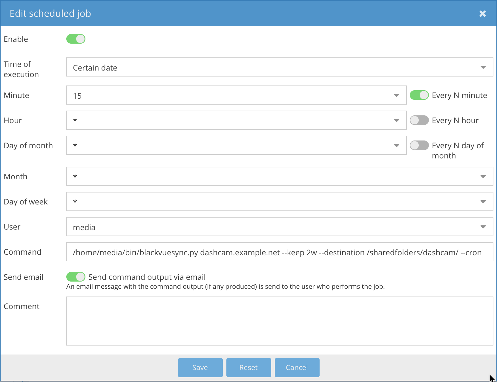

# BlackVue Sync

Synchronizes recordings from a BlackVue dashcam with a local directory over a LAN. Implements several features to facilitate operating in a scheduled, unattended fashion. A typical setup would be a NAS running a cron job.

BlackVue cameras expose an HTTP server -- sadly no HTTPS -- that can be used to download all recordings. This project downloads only recordings that are not already downloaded, optionally limiting recordings in a local directory to a date range.

## Features

* *Portable:* Implemented as a single, self-contained Python script with zero 3rd party dependencies. The script can just be copied and run anywhere.
* *Smart*: Only downloads recordings that haven't been downloaded yet.
* *Resilient*: If the data transfer is interrupted for whatever reason, at the next run the script resumes where it left off.
* *Hands-off*: Optionally retains recordings for a limited amount of time, removing outdated ones.
* *Cron-friendly*: Only one process is allowed to run at any given time for a specific download destination.
* *Safe*: Stops executing if the disk is almost full.
* *Friendly*: Identifies a range of known error conditions and clearly communicates them.


## Prerequisites

* Python 3.5+.
* A BlackVue dashcam connected to the local network. Tested with a DR750S.
* The destination directory must be on a local filesystem.

### Verifying connectivity to the dashcam

A quick way to verify that the dashcam is available is by using curl. For all examples, we will assume that the camera address is ```dashcam.example.net```.

```
$ curl http://dashcam.example.net/blackvue_vod.cgi
v:1.00
n:/Record/20181026_135003_PF.mp4,s:1000000
n:/Record/20181026_140658_PF.mp4,s:1000000
n:/Record/20181026_140953_PF.mp4,s:1000000
...
$
```

Another way is to simply browse to: `http://dashcam.example.net/blackvue_vod.cgi`.

### Compatibility

Tested with: `DR750S`

Should work with: `DR900S`, `DR750S`, `DR650S`, `DR590/590W`, `DR490/490L` Series.

Reports of models working or not other than those tested are appreciated.


## Usage

### Manual Usage

The most basic usage is to pass the dashcam address to the script:

```
$ blackvuesync.py dashcam.example.net
```

It's also possible to specify a destination directory other than the current:

```
$ blackvuesync.py dashcam.example.net --destination /mnt/blackvue
```

A retention period can be indicated -- e.g. two weeks. Recordings prior to the retention period will be removed from the destination.

```
$ blackvuesync.py dashcam.example.net --destination /mnt/dashcam --keep 2w
```

### Unattended Usage

#### Plain cron

The script can be run unattended by setting up a periodic  [cron](https://en.wikipedia.org/wiki/Cron) job on UNIX systems.

Simple example with crontab for a hypothetical ```media``` user:

```
*/15 * * * * /home/media/bin/blackvuesync.py dashcam.example.net --keep 2w --destination /mnt/dashcam --cron
```

The ```--cron``` option changes the logging level with the assumption that the output will be emailed. When this option is enabled, the script will only log when normal recordings are downloaded and when unexpected error conditions occur. One would typically see an email only after driving or when something goes wrong.

Note that if the dashcam is unreachable for whatever reason, in ```--cron``` mode no output is generated, since this is an expected condition whenever the dashcam is away from the local network.

#### NAS

##### openmediavault

The [openmediavault](http://www.openmediavault.org/) NAS solution allows for [scheduled jobs](https://openmediavault.readthedocs.io/en/latest/administration/general/cron.html) with support for mail notifications.

Example:




## License

This project is licensed under the MIT License - see the [COPYING](COPYING) file for details

Copyright 2018 [Alessandro Colomba](https://github.com/acolomba)
